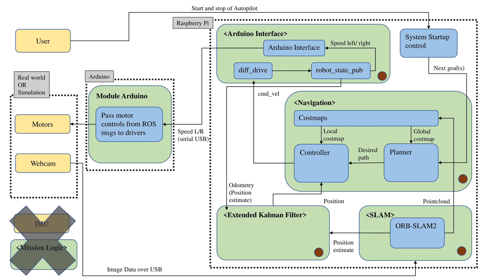

# 2022-TUB-MARS-autopilot

This repository contains our code for the autopilot B group from the MARS project course in summer semester 2022 at the TU Berlin. The workspace is meant to run inside a Docker container. It is also preconfigured to enable developing from inside of that container. 

For now, the code in this repository enables to do the following:
- Run a Gazebo simulation with a virtual maize field world as (here)[https://github.com/FieldRobotEvent/Virtual_Field_Robot_Event_21/blob/master/virtual_maize_field/README.md]
- Define the MARS robot with links, joints and other properties (weight, friction, ...). The model can be spawned into the Gazebo simulation
- An interface to an Arduino to pass speed commands from ROS. This contains code for the Arduino as well to control the motors correspondingly
- Control the real or simulated robot using a joystick or keyboard
- Run a visual Slam (ORB-Slam2) within ROS2 using a mono USB camera
- Fure the pose estimate from Slam with the odom from the driving plugin using an EKF
- Get navigation2 running but **parameters are not set properly**
- Dockerfile to build an image that runs ROS2 foxy with all dependencies for the above functionalities

For a complete autopilot in a maize field we see following steps left open:
- Tune navigation parameters. this should enable the system to navigate to a given goal pose from RViz in combination with the existing features of this workspace
- Develop a mission logic module that derives navigations goals based on the surrounding. This should detect patterns of rows of maize plants, set goals in between and remember which rows were already visited

## Software Architecture

The image shows the rough software architecutre of the repository. Most parts of the software are supposed to run on a computer (or Raspberry Pi). The computer is supposed to be connected to an Arduino via USB Serial connection. The module *Mission Logic* and an *IMU* as additional source of robot pose is left to do after this project. 

 

## Installation

### Docker
Check [this side](https://docs.docker.com/engine/install/ubuntu/#install-using-the-repository) for the installation. Choose the *installation using the repositories*. After that, add your used to the docker group. This lets you run docker commands without sudo. You might need to reboot for the changes to get effect.
```
sudo usermod -aG docker $USER
```
Check if you are able to run docker without sudo by check, whether executing `docker ps` works. 
All commands like building and running packages in the following readme expect you to be inside the Docker container!

### Clone workspace with submodules
Clone this workspace. To be able to do so, you might need to have a SSH-key created and added to your Github account, see [here](https://docs.github.com/en/authentication/connecting-to-github-with-ssh/generating-a-new-ssh-key-and-adding-it-to-the-ssh-agent#generating-a-new-ssh-key). Clone the repository
```
git clone git@github.com:skasts/2022-TUB-MARS-autopilot.git
```
Also clone external repositories (aka submodules) into src
```
cd src/
vcs import < ros2.repos
cd ..
```

### Build and enter Docker image
To build the Docker image there are two options. You could either use Docker from command line (cli) or, what is recommended for developing, build it using Visual Studio Code (VS Code) and then run and delevop things from there. 
#### 1) Docker from CLI (not recommended)
Build the image. This can easily take more than 20 minutes, depending on your hardware and internet connection. 
```
docker build -t mars:1.0 .devcontainer/
```
Run a container from the image with the following command. The `-rm` flag removes the container afterwards what will delete all changes, so you might want to drop the flag. Still, as the repository's folder is passed as a bind mount, changes like build files in this folder will be stored locally and not lost when starting a new container.
```
docker run --user ros --rm -it --network=host --privileged --mount type=bind,src=~/2022-TUB-MARS-autopilot,dst=/workspaces/2022-TUB-MARS-autopilot --volume=/dev:/dev -w /workspaces/2022-TUB-MARS-autopilot --name mars mars:1.0
```
To attach a new terminal to a running container (i.e. to execute another process), run
```
docker exec -it mars bash
```

#### 2) Docker with VS Code (recommended)
You can also build the image and run a container using VS Code. The settings how to run the container are stored in *.devcontainer/devcontainer.json*. 
##### Prerequisites
- have VS Code installed (`sudo apt update && sudo apt install code`)
- Extension `Remote - Containers` installed

##### Usage
- Click the small green symbol in the bottom left
- Choose *Reopen in container* from drop down options
This will start building the image. This can easily take more than 20 minutes, depending on your hardware and internet connection. When you do this the second time, VS Code will directly start the container without delay, as it does not need to build it again.
- Open terminal windows in VS Code to execute commands. They will run inside the container. 

### Build workspace
Do the following inside of a container! 
The building process takes around 30 minutes, depending on your computer. Every time you change a package, it has to be rebuilt (unless only changing python files). To build all packages in the workspace run
```
colcon build --symlink-install
```
to only build selected packages, append `--packages-select <name1 name2 ...>` to the command above. Also, to save time, you can delete packages from your src folder that you don't want to use, i.e. Navigation2. Everytime when a package changed, it needs to be rebuilt for the changes to take effect. Simply use the above command again, it will only rebuild changed files and be much quicker than the first time. 

In each terminal that you open, you need to source the *setup.bash*. If you don't do that, the system won't know about your built packages. So, always execute `. install/local_setup.bash` in each terminal you open (being in the main folder).

## Usage 
### Launch files to run functions
Use the launch files from the *mars_robot* pkg to start parts of the system. The usage is 
```
ros2 launch mars_robot <name_launch_file>
```
Remember to run `. install/local_setup.bash` in every terminal before. The following launch files exist:
- `robot_state_publisher.launch.py` starts a robot state publisher for the MARS robot 
(as decribed in *urdf/mars_robot.urdf.xacro*)
- `diff_drive_controller.launch.py` starts the robot state publisher together with a controller with 
a differential drive plugin (cmd_vel -> speeds left and right) and a joint state broadcaster plugin 
(transformations for wheels according to the set speed)
- `orb_slam2_mono.launch.py` starts the Slam algorithm (ORB-Slam2) for a mono camera, a OpenCV-ROS2 
camera driver and the covariance adder node. The camera driver is needed to get the camera images as 
ROS msgs, the covariance adder adds covariance information to the pose estimate we get from the 
slam. The covariance information is needed by the kalman filter to be able to fuse the slam's pose 
estimate with the odom pose estimate from the drive plugin. See *slam.yaml* for configs. 
*camera_info_640x480.ini* is the calibration file for the used camera, you need to do this for your 
particular camera for better results. You can tweak the config for the camera driver right within 
the launch file (resolution, fps, video from file, ...)
- `ekf.launch.py` starts the robot localization package that runs a Kalman filter to fuse the pose 
estimates from the slam and the drive plugin. See *ekf.yaml* for config information. This could be
extended by other pose estimates like one from an IMU sensor.
- `system.launch.py` starts all above mentioned parts of the system together by including the 
individual launch files. This does not start navigation, as the parameters still need to be tuned.
- `navigation.launch.py` starts the Nav2 navigation stack and RViz with a navigation view. The 
parameters for Nav2 are set in *params.yaml* but are in **desperate need of being tuned**. Some of 
the parameters for i.e. the global and local costmap do not make sense at the moment.
- `gazebo.launch.py` starts a Gazebo simulation with the Virtual Maize Field world and spawns the 
MARS robot into that world. This requires you to have generated a maize field world before. You can 
do this with `ros2 run virtual_maize_field generate_world fre22_task_navigation_mini --show_map`. 
Edit the corresponding `fre22_task_navigation_mini` config in its package to change the world's 
parameters.
In order to start the arduino interface, execute
- `ros2 run arduino_interface arduino_interface`

#### Control ROSBot with XBox ONE controller

* If your computer already got Bluetooth, you can skip this step, otherwise: Connect the bluetooth-USB-dongle to your computer
* To activate ERTM, install `sudo apt-get install sysfsutils`
* append `module/bluetooth/parameters/disable_ertm = 1` to file `/etc/sysfs.conf`
* Restart sysfsutils `sudo service sysfsutils restart`
* Turn on controller, press pairing button (next to USB-slot) for three seconds to enter pairing mode
* Connect to controller via CLI

  ```
  $ bluetoothctl
  [bluetooth]# power off
  [bluetooth]# power on
  [bluetooth]# scan on   //you get messages like: [NEW] Device EC:83:50:B0:C6:DE Xbox Wireless Controller
  [bluetooth]# trust EC:83:50:B0:C6:DE
  [bluetooth]# pair EC:83:50:B0:C6:DE
  [bluetooth]# connect EC:83:50:B0:C6:DE 
  
  ```
* (Good tool to check controller connection `sudo apt install jstest-gtk`)
* **Start ROS2 node** `ros2 launch teleop_twist_joy teleop-launch.py joy_config:='xbox'`
* You need to press the *teleop enable button* while controlling the robot. You can change key settings in `/opt/ros/foxy/share/teleop_twist_joy/config/xbox.config.yaml`


#### Start Gazebo from CLI
This runs the Gazebo simulation (Server and GUI) from CLI. 
```
ros2 launch virtual_maize_field simulation.launch.py verbose:='True'
```
By adding `headless:='True'` to the command, you start Gazebo without GUI. This can reduce computational load. If needed, you can start the GUI later with `ros2 launch gazebo_ros gzclient.launch.py use_sim_time:='True' verbose:='True'`.
#### Run RViz
This starts RViz with a preconfigured view.
```
rviz2 -d src/autopilot/config/default_view.rviz
```

#### Extra: Run ORB-Slam3 standalone
In the course of the project we also examined if ORB-Slam3 (not ORB-Slam2) could be an option. We got it running in Docker by building its requirements and the package itself from source. Afaik, there is no ROS2 adaption of it yet, while ORB-Slam2 does have an established ROS2 adaption. Still, if you want to try it, do as follows.
- Uncomment the corresponding lines in the Dockerfile
- Change line 83 in `Examples/Monocular/mono_euroc.cc` to `ORB_SLAM3::System SLAM(argv[1],argv[2],ORB_SLAM3::System::MONOCULAR, true);` (was false before). This activates the viewers. Also, the example requires the (EuRoC dataset (V101))[http://robotics.ethz.ch/~asl-datasets/ijrr_euroc_mav_dataset/vicon_room1/V1_01_easy/V1_01_easy.zip] to be extracted into `/workspaces/2022-TUB-MARS-autopilot/`.
- Rebuild to let the change take effect (`cd build && make`)
- Run example from ORB_SLAM3
  ```
  cd /ORB_SLAM3
  ./Examples/Monocular/mono_euroc Vocabulary/ORBvoc.txt Examples/Monocular/EuRoC.yaml ../workspaces/2022-TUB-MARS-autopilot/ Examples/Monocular/EuRoC_TimeStamps/V101.txt 
  ```

## Debug information

#### Kill all old Gazebo processes
Often it happens, that Gazebo does not terminate completely after shutting it down. Then, if you start it again, you get an error like 'there is already an instance existing'. To kill any old Gazebo process, use the following.
```
pkill gzserver
```
#### Restart ROS2 daemon
If you experience unwanted behavior with ROS, i.e. no nodes found with `ros2 node list`, stop and start the daemon again.
```
ros2 daemon stop; ros2 daemon start
```
#### Get all transformations
The following creates a PDF ('frames.pdf') with all current TFs. 
```
ros2 run tf2_tools view_frames.py
```
#### Delete a model from Gazebo
To delete an entity from Gazebo, use this.
```
ros2 service call /delete_entity gazebo_msgs/srv/DeleteEntity "{name: 'robot'}"
```
#### Control robot from keyboard
The robot received velocity commands of the topic `/cmd_vel`. You can directly publish onto this topic with a keyboard controller package.
```
ros2 run teleop_twist_keyboard teleop_twist_keyboard
```
#### Configure git in container if you want to commit / push
If you want to commit and push to the repository, git in the container needs to know who you are. Tell it with the following commands.
```
git config --global user.name "Simon Kast"
git config --global user.email 57326251+skasts@users.noreply.github.com
```

#### Configure Raspberry Pi to run this code
The recommended way is to install Docker on the Raspberry Pi. This enables to use this code as on any normal computer. It also exploits the advantages of Docker that we do not need to worry about dependencies. To get Docker running on the Raspberry, you should install a 64-bit version of Raspbian (best case a headless version to save resources).